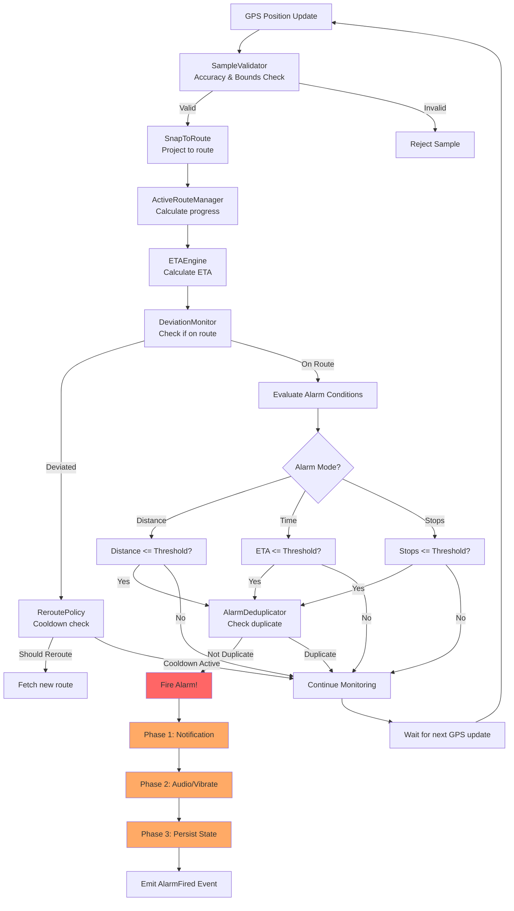

# GeoWake Architecture - Visual Diagrams (Mermaid)

This document contains visual architecture diagrams using Mermaid syntax that can be rendered directly in GitHub, IDEs, and documentation viewers.

---

## 1. High-Level System Architecture


---

## 2. Journey Start Flow


---

## 3. Background Tracking & Alarm Decision Flow



---

## 4. Service Architecture Details


---

## 5. Data Flow Architecture


---

## 6. State Persistence & Recovery


---

## 7. Alarm Orchestrator State Machine


---

## 8. Route Cache Strategy

```mermaid
flowchart TD
    Request[Route Request] --> Online{Online?}
    
    Online --> |No| CheckCache1[Check Cache]
    CheckCache1 --> |Hit| UseCache1[Use Cached Route]
    CheckCache1 --> |Miss| Error[Return Error]
    
    Online --> |Yes| CheckCache2[Check Cache First]
    CheckCache2 --> ValidateTTL{TTL Valid?<br/>< 5 min}
    
    ValidateTTL --> |No| FetchAPI
    ValidateTTL --> |Yes| CheckOrigin{Origin Deviation?<br/>< 50m}
    
    CheckOrigin --> |No| FetchAPI[Fetch from API]
    CheckOrigin --> |Yes| UseCache2[Use Cached Route<br/>80% hit rate!]
    
    FetchAPI --> Process[Process Response]
    Process --> Decode[Decode Polyline]
    Decode --> Simplify[Simplify<br/>Douglas-Peucker]
    Simplify --> Store[Store in Cache]
    Store --> Encrypt[Encrypt AES-256]
    Encrypt --> Return[Return Route]
    
    UseCache1 --> Return
    UseCache2 --> Return
    
    Return --> [*]
    Error --> [*]
    
    style UseCache2 fill:#99ff99
    style FetchAPI fill:#ffcc99
    style Error fill:#ff9999
```

---

## 9. Battery & Power Management


---

## 10. Event Bus Communication


---

## 11. Security Layers


---

## 12. Component Dependencies


---

**Note**: These Mermaid diagrams can be viewed directly in:
- GitHub (automatic rendering)
- VS Code (with Mermaid preview extension)
- IntelliJ/PyCharm (with Mermaid plugin)
- Any Markdown viewer with Mermaid support

To export as images:
- Use [Mermaid Live Editor](https://mermaid.live)
- Use CLI tools like `mmdc` (mermaid-cli)
- Use IDE export functions

---

**Document Version**: 1.0.0  
**Created**: October 24, 2025  
**Format**: Mermaid Diagrams
